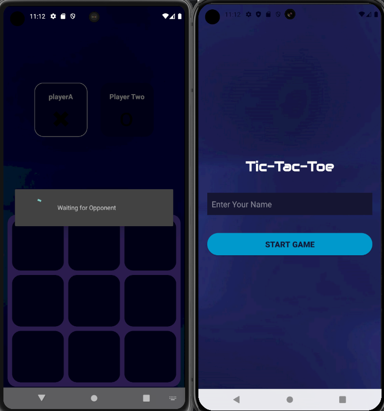

# Tic-Tac-Toe Android Application with Firebase Realtime Database

This is a simple two-player Tic-Tac-Toe game developed for Android using Java and Android Studio. It utilizes Firebase Realtime Database for real-time data synchronization between players, allowing for cross-device play.

## Features

*   Two-player gameplay, **supporting play between different devices** as long as they use the same Firebase project configuration.
*   Real-time synchronization using Firebase Realtime Database.
*   **Firebase Realtime Database configured in test mode for easy access and testing.**
*   User-friendly interface.
*   Clear win/draw dialogs.
*   Input validation for player names.

## Screenshots

*(Here you can include screenshots of your application. It's highly recommended to add some. You can use tools like `fastlane` or simply take screenshots manually and include them in a `screenshots` folder.)*





## Technologies Used

*   Java
*   Android Studio
*   Firebase Realtime Database
*   Android SDK

## Setup and Installation

1.  Clone the repository:

    ```bash
    git clone [https://github.com/adanlaldy/tic-tac-toe](https://github.com/adanlaldy/tic-tac-toe)
    ```

2.  Open the project in Android Studio.

3.  **To play with another person on a different device, both players must use the same Firebase project configuration.** This means sharing the `google-services.json` file.

4.  Set up a Firebase project in the Firebase console ([https://console.firebase.google.com/](https://console.firebase.google.com/)).

5.  Add Firebase to your Android app by following the instructions in the Firebase console. Download the `google-services.json` file and **ensure that both players use this same file** by placing it in the `app/` directory of their respective projects. Add the URL of the Firebase Realtime Database in the MainActivity.

6.  **Important:** The Firebase Realtime Database is currently configured in test mode. This means that anyone with the database URL (obtained through the `google-services.json` file) can read and write data. **For a production environment, it is crucial to configure appropriate security rules to protect your data.** See the Firebase documentation for more information on security rules: [https://firebase.google.com/docs/rules](https://firebase.google.com/docs/rules).

7.  Build and run the application on Android devices or emulators.

## Usage

1.  Launch the application on both devices.
2.  Enter the names of the two players in the `PlayerActivity` on each device.
3.  Start the game.
4.  Players take turns tapping on the game board.
5.  The game ends when one player wins (three in a row horizontally, vertically, or diagonally) or when the board is full (a draw).
6.  A dialog box will appear indicating the result of the game.

## Future Enhancements

*   Implement online multiplayer using Firebase Realtime Database (with proper user authentication and game lobbies).
*   Add game settings (e.g., different board sizes).
*   Improve UI/UX.
*   Add sound effects and animations.
*   Implement a scoring system.

## Contributing

Contributions are welcome! Please open an issue or submit a pull request.